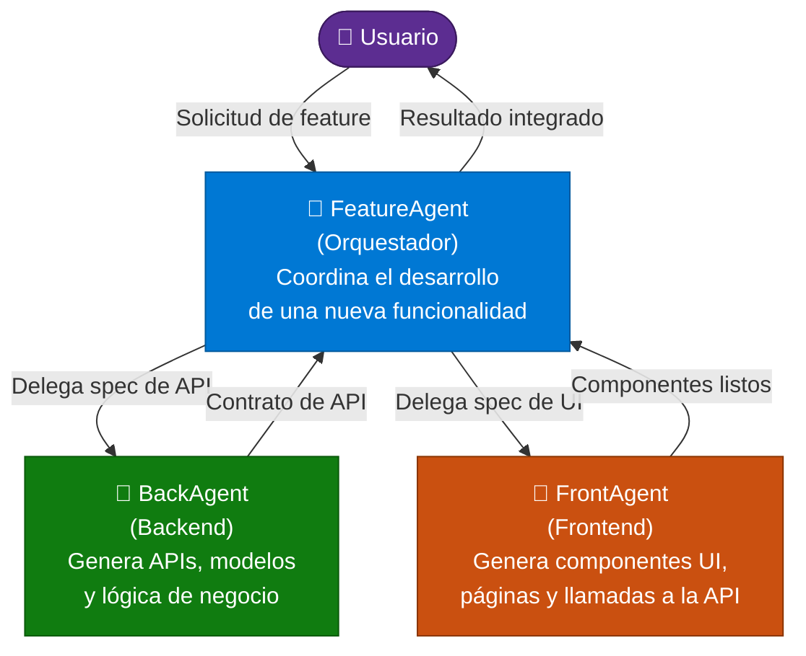

# Sesión 3 — Fundamentos de GitHub Copilot: Agentes

> **Duración:** 30 minutos  
> **Repositorio de práctica:** [https://github.com/SpainCoE-Amaris/agents-poc](https://github.com/SpainCoE-Amaris/agents-poc)  
> Clona el repositorio antes de comenzar: `git clone https://github.com/SpainCoE-Amaris/agents-poc`

---

## Agenda

| Tiempo | Bloque |
|--------|--------|
| 0 – 10 min | Conceptos: Agentes, Skills, Hooks, Instructions |
| 10 – 18 min | Anatomía de un agente: nombre, agents, tools, argument-hint |
| 18 – 30 min | Ejercicio: explorar los agentes `feature`, `back` y `front` del repositorio |

---

## 1. Conceptos clave (0 – 10 min)

### ¿Qué es un Agente en GitHub Copilot?

Un **agente** es una entidad especializada dentro de GitHub Copilot que recibe una descripción de tarea, razona sobre ella y ejecuta acciones usando herramientas (tools). Cada agente tiene un propósito definido y puede colaborar con otros agentes.

```
Usuario ──► Copilot Chat ──► Agente ──► Tools ──► Resultado
```

### Skills

Las **skills** son conjuntos de instrucciones y conocimiento de dominio que amplían las capacidades de un agente. Permiten:

- Inyectar contexto especializado (p. ej. buenas prácticas de Azure, convenciones de código, patrones de UI).
- Delegar a un skill concreto cuando el usuario pregunta sobre ese dominio.
- Reutilizar instrucciones entre agentes distintos.

```
FeatureAgent (Orquestador)
 ├── skill: project-structure    ← convenciones y estructura del proyecto
 └── skill: code-standards       ← estándares de calidad compartidos

BackAgent
 ├── skill: azure-prepare        ← instrucciones para generar infra Azure
 ├── skill: azure-rbac           ← instrucciones de roles y permisos
 ├── skill: cosmosdb-patterns    ← patrones de datos NoSQL
 └── skill: api-rest-conventions ← diseño de APIs REST

FrontAgent
 ├── skill: react-best-practices ← patrones React 18+, hooks modernos
 ├── skill: tailwind-ui          ← componentes con Tailwind CSS
 ├── skill: accessibility        ← WCAG 2.1, testing de a11y
 └── skill: api-client-patterns  ← consumo de APIs, estados con zustand
```

### Instructions

Las **instrucciones** (`instructions`) son el contrato de comportamiento del agente: definen qué hace, cuándo activarse, qué devolver y qué límites respetar. Se escriben en lenguaje natural dentro de la definición del agente.

```yaml
instructions: |
  Eres un agente de backend. Genera APIs REST en Node.js siguiendo
  las convenciones del proyecto. No generes código de frontend.
```

### Hooks

Los **hooks** son puntos de extensión del ciclo de vida del agente:

| Hook | Cuándo se dispara |
|------|-------------------|
| `onStart` | Al iniciar una conversación con el agente |
| `onToolCall` | Antes/después de invocar una tool |
| `onComplete` | Al finalizar la respuesta del agente |

Los hooks permiten inyectar lógica transversal: logging, validaciones de seguridad, transformación de salida, etc.

---

## 2. Anatomía de un Agente (10 – 18 min)

Un agente se define con cuatro partes fundamentales:

```yaml
name: "NombreDelAgente"
description: |
  Descripción clara del propósito y expertise del agente.
  Define cuándo Copilot debe elegir este agente.
agents:
  - AgenteSecundario1
  - AgenteSecundario2
tools:
  - tool_buscar_archivos
  - tool_ejecutar_comando
argumentHint: "Describe qué información necesita el agente para empezar"
```

### Descripción de cada parte

| Campo | Rol | Ejemplo |
|-------|-----|---------|
| `name` | Identificador único del agente | `"BackendAgent"` |
| `description` | Texto que Copilot usa para saber cuándo invocar este agente. Debe ser preciso y contener palabras clave del dominio | `"Genera APIs REST, modelos de datos, migraciones..."` |
| `agents` | Lista de sub-agentes que este agente puede orquestar | `["FeatureAgent", "FrontAgent"]` |
| `tools` | Herramientas que el agente puede invocar (búsqueda, terminal, lectura de archivos, llamadas a APIs) | `["read_file", "run_in_terminal"]` |
| `argumentHint` | Sugerencia al usuario sobre qué contexto aportar al invocar el agente | `"Describe el endpoint a crear y el modelo de datos"` |

---

## 3. Los tres agentes del proyecto (18 – 30 min)

### Diagrama de interacción



### FeatureAgent — Orquestador principal

- **Rol:** Recibe la petición del usuario y la descompone en tareas de backend y frontend.
- **Agents:** `BackAgent`, `FrontAgent`
- **Tools:** Lectura de código existente, búsqueda en el repositorio, creación de archivos de spec.
- **ArgumentHint:** `"Describe la feature a implementar (nombre, comportamiento esperado, criterios de aceptación)"`

### BackAgent — Especialista en Backend

- **Rol:** Genera endpoints REST, modelos de datos, migraciones y tests de integración.
- **Agents:** *(ninguno — agente hoja)*
- **Tools:** Lectura/escritura de archivos, ejecución de comandos (`npm test`, `dotnet build`).
- **ArgumentHint:** `"Describe el endpoint, el modelo de datos y las reglas de negocio"`

### FrontAgent — Especialista en Frontend

- **Rol:** Genera componentes React/Vue, páginas, hooks y llamadas a la API del backend.
- **Agents:** *(ninguno — agente hoja)*
- **Tools:** Lectura/escritura de archivos, búsqueda de componentes existentes.
- **ArgumentHint:** `"Describe la pantalla o componente a crear y el contrato de API que debe consumir"`

---

## Ejercicio práctico

1. **Clona el repositorio:**
   ```bash
   git clone https://github.com/SpainCoE-Amaris/agents-poc
   cd agents-poc
   ```

2. **Abre el repositorio en VS Code y explora las definiciones** de los agentes `feature`, `back` y `front`.

3. **Identifica** en cada agente: `name`, `description`, `agents`, `tools` y `argumentHint`.

4. **Prueba el flujo completo:** invoca el `FeatureAgent` con una petición sencilla, por ejemplo:
   > *"Crea una feature de login con email y contraseña"*
   
   Observa cómo delega tareas a `BackAgent` y `FrontAgent`.

5. **Debate en grupo:**
   - ¿Qué ventajas tiene descomponer el trabajo en agentes especializados?
   - ¿Cómo usarías hooks para añadir validaciones de seguridad?
   - ¿Qué skills añadirías a cada agente?

---

## Resumen

| Concepto | En una frase |
|----------|-------------|
| **Agente** | Entidad especializada que razona y actúa usando tools |
| **Skill** | Bloque de conocimiento de dominio reutilizable |
| **Instructions** | Contrato de comportamiento del agente |
| **Hook** | Punto de extensión del ciclo de vida del agente |
| **FeatureAgent** | Orquestador que coordina back y front |
| **BackAgent** | Especialista en APIs y lógica de negocio |
| **FrontAgent** | Especialista en UI y consumo de APIs |
